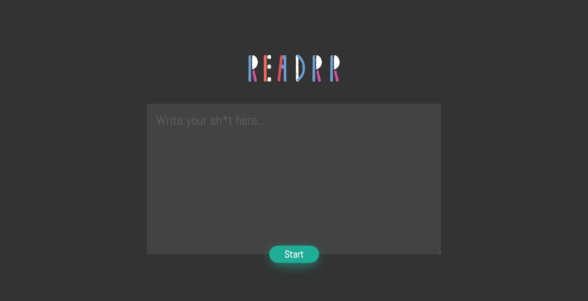

# [Readrr](https://readrr.surge.sh/)
A speed reading thing I built for myself. You can use it too if you want.

## Screenshot

## Instructions
Just add the text you want to read and then press the Start button. It will display each word in text you added.

## Rationale
When you focus on the words and something is quickly displaying those words for you, you realize you can actually read pretty fast and can cover a lot of text much faster than you usually would.

## Notes
Thanks to my sister for the mockup. Hopefully she'll continue mocking up more features LOL.

## License
MIT